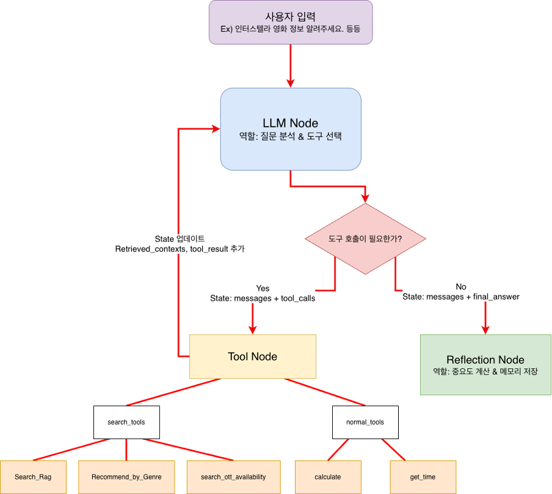

# Movie Chat Agent (Team 생JH)

> **2025-2학기 한국항공대학교 생성형AI응용 Final Project** > 사용자와 자연스러운 대화를 통해 영화를 추천하고 정보를 제공하는 LangGraph 기반 AI 에이전트

## 프로젝트 개요 (Project Overview)
이 프로젝트는 **OpenAI gpt-4o-mini**를 기반으로 **LangGraph** 구조와 **RAG(Retrieval-Augmented Generation)**를 활용하여 구현된 영화 정보 검색 및 추천 대화형 에이전트입니다.

사용자의 질문 의도를 파악하여 RAG를 통해 영화 정보를 검색하거나, 도구(Tool)를 활용해 OTT 시청 가능 여부 확인, 계산, 시간 확인 등의 작업을 수행합니다. [cite_start]또한, 장기/단기 메모리 및 Reflection 시스템을 통해 개인화된 대화 경험을 제공합니다. [cite: 31, 39-41]

## 팀원 및 역할 (Team Members)
| 학번 | 이름 | 역할 | 담당 업무 |
|:---:|:---:|:---:|:---|
| 2021128007 | **김정훈** (팀장) | RAG, Backend | RAG 시스템 구축, 벡터 검색, Gradio UI+FastAPI 통합 |
| 2021125017 | **김지홍** | Memory, Agent | LangGraph 설계, Memory 시스템(단기/장기/Reflection), FastAPI 통합 |
| 2023125065 | **홍지호** | Tools, UI | 일반 Tool 구현(OTT, 계산 등), Gradio UI+FastAPI 통합, LangGraph 설계 |

## 기술 스택 (Tech Stack)
* **LLM:** OpenAI gpt-4o-mini
* **Orchestration:** LangGraph (ReAct Pattern)
* **Vector DB:** ChromaDB (Persistent)
* **Embedding:** OpenAI text-embedding-3-small (Multilingual)
* **Backend & UI:** FastAPI, Gradio
* **Language:** Python 3.11+
* **External API:** Google Custom Search API (OTT 검색용)

## 시스템 아키텍처 (System Architecture)

### 1. LangGraph Agent 구조
[cite_start]`LLM Node` ↔ `Tool Node` ↔ `Reflection Node`의 순환 구조를 가집니다. [cite: 37-41]



* **LLM Node:** 사용자 질문 분석 및 도구 호출 결정
* **Tool Node:** RAG 검색, OTT 정보 확인, 계산기 등 기능 수행
* **Reflection Node:** 대화의 중요도를 계산하여 장기 메모리에 저장 (Importance Score > 0.3)

### 2. RAG 시스템
* **데이터셋:** TMDB API 기반 19개 장르, 4,885개 영화 정보 (PDF)
* **청킹 전략:** 영화 1개 = 1 Chunk (500자 단위, Overlap 50자)
* **임베딩:** 128개씩 배치 분할 처리

### 3. Memory 시스템
* [cite_start]**Short-term:** LangGraph State + MemorySaver (세션 유지) [cite: 63-67]
* [cite_start]**Long-term:** ChromaDB Persistent (중요 대화 영구 저장) [cite: 68-70]
* [cite_start]**Reflection:** 도구 사용(+0.3), RAG 사용(+0.2) 등의 조건으로 중요도 판단 및 자동 저장 [cite: 74-82]

## 프로젝트 구조 (Directory Structure)
```bash
SangJH/
├── app.py                         # FastAPI + Gradio 메인 서버
├── .env                           # API Key 설정
├── requirements.txt               # 의존성 패키지
├── assets/                        # 이미지 리소스
│   └── langgraph_architecture.png # 아키텍처 다이어그램
├── src/
│   ├── graph/                     # LangGraph 에이전트 (Agent, Nodes)
│   ├── memory/                    # 메모리 시스템 (Short/Long, Reflection)
│   ├── rag/                       # RAG 시스템 (Loader, VectorStore, Retriever)
│   ├── tools/                     # Tool 함수 (Search, OTT, Calc, Time)
│   ├── ui/                        # Gradio UI 설정
│   └── schemas.py                 # State 정의
└── data/                          # 데이터 폴더
    ├── vector_db/                 # RAG ChromaDB
    └── memory_db/                 # Memory ChromaDB